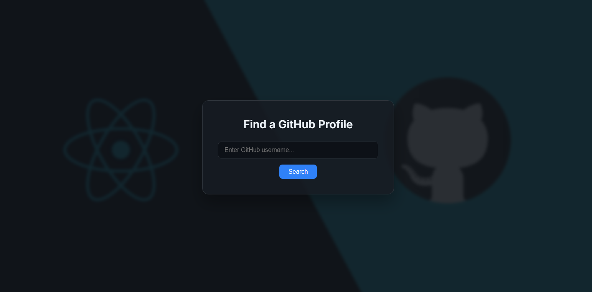
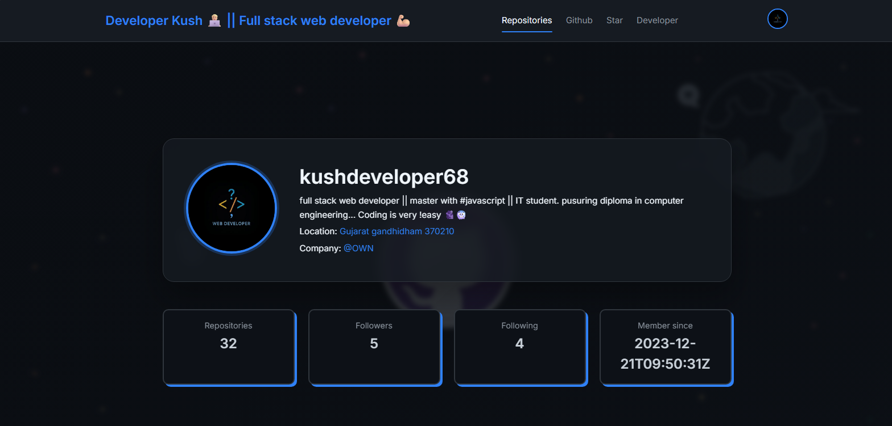
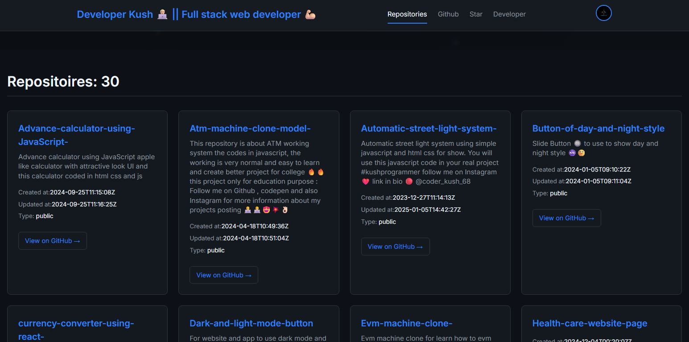
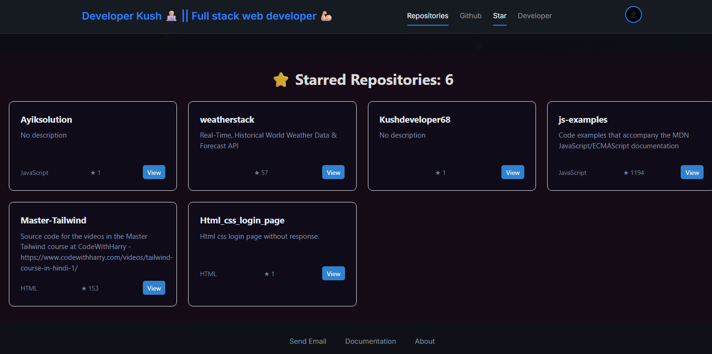

# 🚀 Own GitHub Explorer

A modern and beautifully designed **GitHub Explorer** built with **Vite + React**. This project allows users to search any GitHub username and view their **profile details**, **repositories**, and **starred repositories** using the official GitHub REST API.

---

## 📸 Project Preview
<p align="center">




</p>
---

## ✨ Features

✅ Fetch and display **GitHub user profile details**  
✅ List all **public repositories** of the user  
✅ Show **starred repositories**  
✅ **Search functionality** by GitHub username  
✅ **Custom hooks** for fetching data  
✅ **Context API** for state management  
✅ **Loading indicator** for smooth UX  
✅ Fully responsive and **fantasy UI/UX design**  
✅ Clean **component structure** and **code organization**

---

## 🔗 Live Demo

👉 [Check Live Demo Here](https://github-explorer-git-main-kushdeveloper68s-projects.vercel.app/) 

---

## ⚙️ Tech Stack

- ⚡️ **Vite** — for blazing fast development
- ⚛️ **React** — modern UI library
- 🎨 **CSS** — custom styling with fantasy color palettes
- 🗂️ **React Router** — routing and navigation
- 🔗 **GitHub REST API** — data fetching
- ⚙️ **JavaScript ES6+**
- 🔄 **Context API & Props** — state and data flow management

---

## 📂 Project Structure

```plaintext
Own-Github-Explorer/
│
├── public/ # Static assets
│
├── src/
│ ├── components/ # Reusable components (Cards, Navbar, Loader, etc.)
│ ├── hooks/ # Custom hooks for API calls (useFetchUser, useFetchRepos, etc.)
│ ├── pages/ # Main pages (Home, Repos, Starred)
│ ├── context/ # Context for global state
│ ├── App.jsx # Main App component with routes
│ ├── index.css # Global styles
│ ├── main.jsx # Entry point
│
├── .gitignore
├── index.html
├── package.json
├── README.md
└── vite.config.js
```

---

## 🔑 APIs Used

1. [User Details API](https://api.github.com/users/kushdeveloper68)  
2. [User Repositories API](https://api.github.com/users/Kushdeveloper68/repos)  
3. [Starred Repositories API](https://api.github.com/users/Kushdeveloper68/starred)

---

## 🧑‍💻 How to Use

Follow these simple steps to get the project up and running on your local machine.

```bash
# 1️⃣ Clone the repository
git clone https://github.com/Kushdeveloper68/Own-Github-Explorer.git

# 2️⃣ Navigate to the project directory
cd Own-Github-Explorer

# 3️⃣ Install dependencies
npm install

# 4️⃣ Run the development server
npm run dev
```

Open [http://localhost:5173](http://localhost:5173) to view it in your browser.

---

## 📌 How It Works

- Enter a **GitHub username** in the input field.
- The app fetches **profile data**, **repositories**, and **starred repos** using **REST APIs**.
- Displays all fetched data with a beautiful card layout.
- A **loading spinner** is shown while the data is being fetched.
- Uses **custom hooks** to keep API logic clean and reusable.
- Data is managed using **React Context** and **Props**.

---

## 📈 Future Improvements

- [ ] Add pagination for repositories.
- [ ] Support for private repos with OAuth.
- [ ] Add dark/light theme toggle.
- [ ] Improve error handling for invalid usernames.

---

## 🎨 UI/UX

The project uses a **fantasy-themed design** with a modern color palette, smooth animations, and a fully responsive layout for all devices.

---

## 🤝 Contributing

Contributions are always welcome!  
Feel free to submit a **Pull Request** or open an **Issue** for suggestions or bugs.

---

## ⭐️ Show Your Support

If you like this project, please give it a ⭐️ on [GitHub](https://github.com/Kushdeveloper68/Own-Github-Explorer)!  
Your support helps me grow and build more awesome projects.

---

## 📜 License

This project is open source and available under the **MIT License**.

---

## 📧 Contact

Made with ❤️ by **Kush Pandit**

